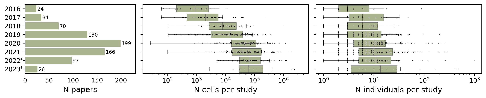

# Extraction of the number of donors per study

To determine the number of donors and cells profiled per study over time, a list of publications was obtained from a curated [database of single-cell studies](https://www.nxn.se/single-cell-studies) on 12 April 2024. 769 papers containing data from human subjects but not culture or organoid data were selected. The number of publications per year and the number of cells per publication were obtained from the database. The number of donors in each study was extracted manually from 208 papers, together with sentences in which this information was found. For the remaining publications, we extracted these statistics automatically with manual curation as described below. PDF files for 461 papers were downloaded with [Open Access Button](https://openaccessbutton.org/), and converted to .txt format using PyPDF2 python library. For automated retrieval of sentences containing donor-related information a logistic regression model was trained on the manually extracted sentences with donor numbers as positive samples and 10,000 random sentences from all selected publications as negative samples embedded with the HuggingFace sentence transformer model "all-MiniLM-L6-v2"170. To extract donor numbers for each paper, sentences with a predicted probability exceeding 0.5 were extracted and fed into the OpenAI gpt-3.5-turbo model171. System prompt “You are helping to extract the data from scientific papers. Give short answer and the source sentence, from which you extracted the information” and the message “For how many donors (patients, individuals) were single-cell RNA sequencing data analyzed in this study?” were used. Out of 119 publications where data was extracted both by the GPT model and manually, the number of donors was identical in 91 cases (76.5%). The 28 inconsistencies were manually checked, showing that the information in human annotation was correct in 13 cases, GPT answers were correct for 12 publications, and in 3 cases both annotations were wrong. Given the reasonable accuracy and outstanding processing speed, information about the number of donors from 325 more papers was extracted by GPT with human evaluation of  supporting sentences. In doubtful cases or when a text of a publication was not accessible through Open Access Button, the information was obtained manually.

Corresponding code and data can be found in the [donors_per_study_plot](donors_per_study_plot) directory. It contains 2 notebooks:
 - 01_papers_scrapping.ipynb for downloading single-cell papers available in the open access, and extraction of the number of donors from their texts
 - 02_analysis.ipynb for creating plots

The [donors_per_study_plot/data](donors_per_study_plot/data) directory contains starting, intermediate and final tables. Data flow can be traced in [01_papers_scrapping.ipynb](donors_per_study_plot/01_papers_scrapping.ipynb). The tables mostly contain the same information with some columns altered or added. Here is a brief description:
- [01_manual_extraction_2023_02_21.csv](donors_per_study_plot/data/01_manual_extraction_2023_02_21.csv) contains the database at the state in which it was downloaded. Some values in the column "Number individuals" were extracted previously by the database contributors and some are filled manually by us. The column "N_individulas sentence" (not present in the original database) contains the sentence or several sentences, from which the information was extracted
- [02_chatgpt_answers.xlsx](donors_per_study_plot/data/02_chatgpt_answers.xlsx) contains "chatgpt_sentence" column with GPT answers about the number of individuals in the study from a summarized text
- [03_manual_check.csv](donors_per_study_plot/data/03_manual_check.csv) contains the column "chatgpt_n_individuals_answer" with numbers of donors manually extracted from GPT answers ("chatgpt_sentence" column)
- [04_rechecked.csv](donors_per_study_plot/data/04_rechecked.csv) contains the column "rechecked_n_individuals" for cases, when GPT answers disagreed with manual annotation performed previously.
- [2023_02_21_Copy of Single cell studies database_final.csv](donors_per_study_plot/data/2023_02_21_Copy%20of%20Single%20cell%20studies%20database_final.csv) is the studies database with the "Number individuals" column containing information extracted from GPT answers
- [supplementary_1_papers_info.csv](donors_per_study_plot/data/supplementary_1_papers_info.csv) is the filtered version of "2023_02_21_Copy of Single cell studies database_final.csv" containing only the information about human-related studies used to build a plot with trends

# System requirements
- python 3.9
- Python packages listed in [requirements.txt](requirements.txt)

The code has been tested on MacBook Pro with Apple M1 Pro chip and macOS Monterey Version 12.6.

Note that for using the GPT model, you will need an API key from OpenAI. To get it, register at [OpenAI developer platform](https://platform.openai.com/docs/overview).

# Installation
1. Install conda following the instructions in the [documentation](https://docs.conda.io/projects/conda/en/stable/user-guide/install/index.html)
2. Create new environment with Python 3.9:
`conda create --name single_cell_papers_trends python=3.9`
3. Activate the environment:
`conda activate single_cell_papers_trends`
4. Install python dependencies:
`pip install -r requirements.txt`

The installation took less than 2 minutes on the MacBook Pro laptop.

# Reproducibility

To reproduce the plot building, run the [02_analysis.ipynb](donors_per_study_plot/02_analysis.ipynb) notebook. It should take not more that a couple of minutes. All the necessary data is provided in this repository. You should the same plot as above (and some additional plots).

To reproduce extraction of the information from papers, run the code in the [01_papers_scrapping.ipynb](donors_per_study_plot/01_papers_scrapping.ipynb). Please note that downloading the papers, and extracting the information from them will take several hours. Some manual extraction of numbers from GPT answers would also be required. While we welcome any feedback on our approach, we would like to point out that it is likely outdated as the field of natural language processing advances at an astonishing rate. Perhaps, a more productive contribution would be to find errors in the data we extracted (if any) or develop a better approach using current best practices.
